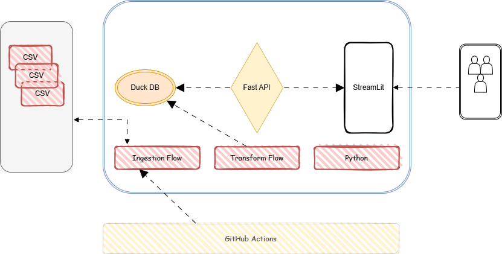

# 🌤️ QueryWeather

A modern weather monitoring system built using **FastAPI**, **Streamlit**, and **DuckDB**, wrapped in a lightweight **Dockerized** architecture.

> Real-time and historical weather metrics dashboard with interactive visualizations.

## 

## 🚀 Features

- 🛰️ Fetch live weather data via OpenWeatherMap API
- 📦 Store structured weather data in DuckDB (embedded)
- 🔍 Query metrics like temperature, humidity, windspeed (with stats & history)
- 📊 Visualize data via an interactive Streamlit dashboard
- 🐳 Dockerized for ease of deployment

---

## 🛠️ Tech Stack

- **Backend**: FastAPI
- **Frontend**: Streamlit
- **Database**: DuckDB
- **API Source**: OpenWeatherMap
- **Deployment**: Docker + Docker Compose
- **Packaging**: Poetry

---

## 🧱 Project Structure

QueryWeather/
├── app/ # FastAPI backend
├── uinterface/ # Streamlit frontend
├── ingestion/ # Weather ingestion logic
├── data/ # CSV & database files
├── Dockerfile
├── docker-compose.yml
├── pyproject.toml

---

### 🐳 Run with Docker (Recommended)

#### 1️⃣ Build and Run

```bash
docker-compose up --build
```

### ⚙️ Local Setup (with Poetry)

#### Clone the Repo

```bash
git clone https://github.com/mkumarsid/QueryWeather.git
cd QueryWeather
```

### Setup using Python Script (Cross-Platform)

Run this once to install Poetry, create a virtual environment, and install dependencies:

````bash
python setup_env.py


# Activate the environment
source .venv/bin/activate   # macOS/Linux
.venv\Scripts\activate      # Windows

# Run the app locally
poetry run python scripts/run_local.py


#### Access Services

- 🚀 FastAPI Docs: http://localhost:8000/docs
- 📈 Streamlit UI: http://localhost:8501


### 🔑 API Configuration

This project pulls data from [OpenWeatherMap](https://openweathermap.org/api).

Update the `API_KEY` in:

```
ingestion/ingest_openweather.py
```

Or make it configurable via `.env` support if needed.

---

### 📁 Data Directory

- Your ingested/historical `.csv` files → stored in `data/`
- Local DuckDB database → `weather_data.db`

---

### ✅ TODOs

- [ ] Add CRON entry in github action job for scheduled ingestion
- [ ] Improve error logging for ingestion
- [ ] Push Docker image to GitHub Container Registry
- [ ] Add authentication for Streamlit

---

### 🤝 Contributing

Have suggestions or want to contribute? Feel free to fork and submit a pull request.

---
````
