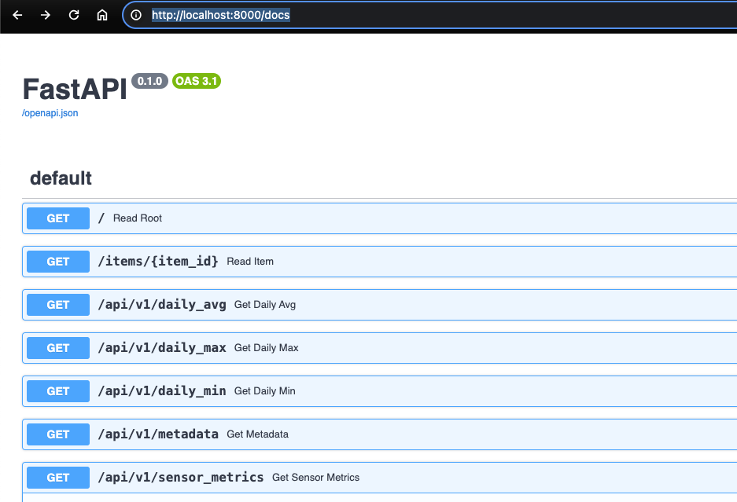
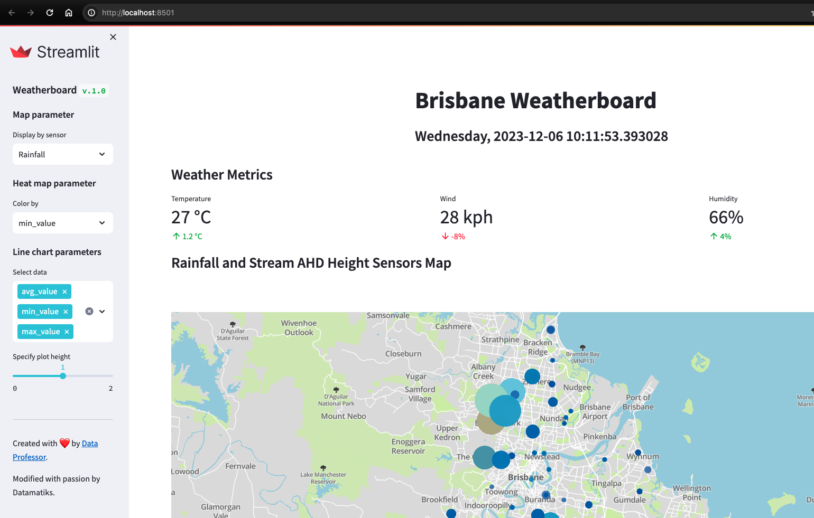

# Query Weather from Live API Sensors

This project goal is to create an IoT platform to Query Weather information from scratch using Modern Data Stack ( DuckDB , FastAPI, Streamlit)

# Pre-requisites

- Prefect Cloud account
- Open Weather Map Account
- Open Weather API URL and Key
- Docker Desktop
- [FastAPI](https://fastapi.tiangolo.com/)
- [Streamlit](https://streamlit.io/)

# How to Run

1. Install pdm

   `$ curl -sSLO https://pdm-project.org/install-pdm.py `

   `$ python3 install-pdm.py [options]`

2. Install dependencies

   `$ pdm install`

3. Activate virtual environment

   `$ eval $(pdm venv activate)`

4. Create '.env' variable inside root directory by renaming .sample-env and then provide your credentials

5. Run docker from root directory

   `$ docker compose up`

# How To Use

1. API - http://localhost:8000/docs

   

2. Web UI (Streamlit App) - http://localhost:8015

   
