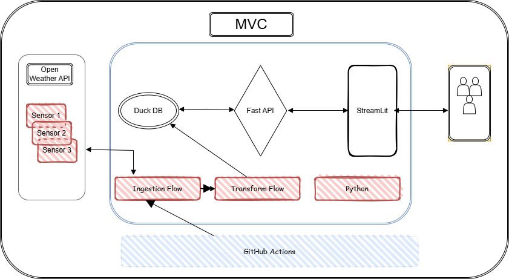

# 🌤️ QueryWeather

A modern weather monitoring system built using **FastAPI**, **Streamlit**, and **DuckDB**, wrapped in a lightweight **Dockerized** architecture.

> Real-time and historical weather metrics dashboard with interactive visualizations.



# Pre-requisites

- [Python 3.11](https://www.python.org/downloads/)
- [Open Weather API Key](https://home.openweathermap.org/api_keys)
- [Docker desktop](https://docs.docker.com/desktop/setup/install/windows-install/)

# How to Run

1. Clone the Repo

```bash
git clone https://github.com/mkumarsid/QueryWeather.git
cd QueryWeather
```

2. Copy Open Weather API key to .env

```bash
cp env.example .env
```

3. Run with Docker (Recommended)

```bash
docker-compose up --build
```

```bash
docker-compose logs -f
```

4. Setup using Python Script (Cross-Platform)

```bash
python setup_env.py

# Activate the environment
source .venv/bin/activate   # macOS/Linux
.venv\Scripts\activate      # Windows

# Run the app locally
poetry run python scripts/run_local.py
```

# Access Services

1. API - http://localhost:8000/docs

   

2. Web UI (Streamlit App) - http://localhost:8501

   
